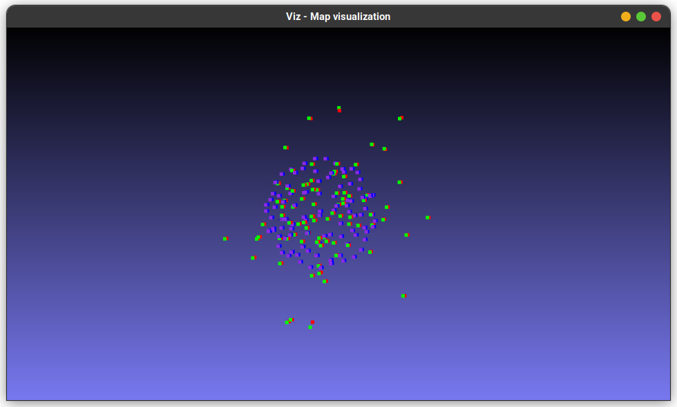
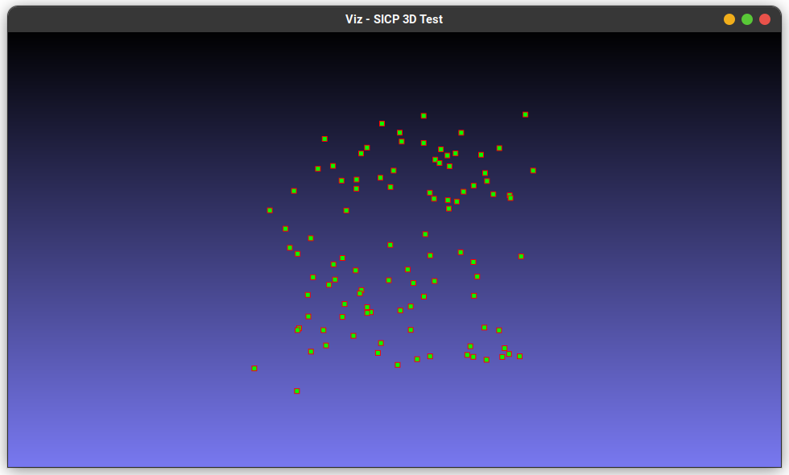
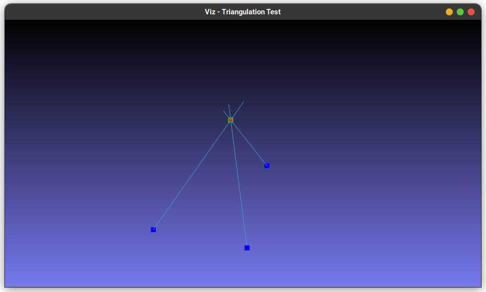
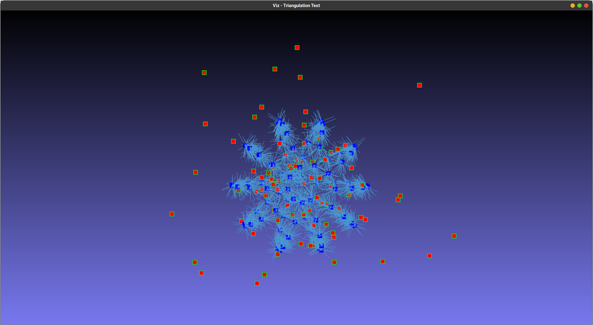
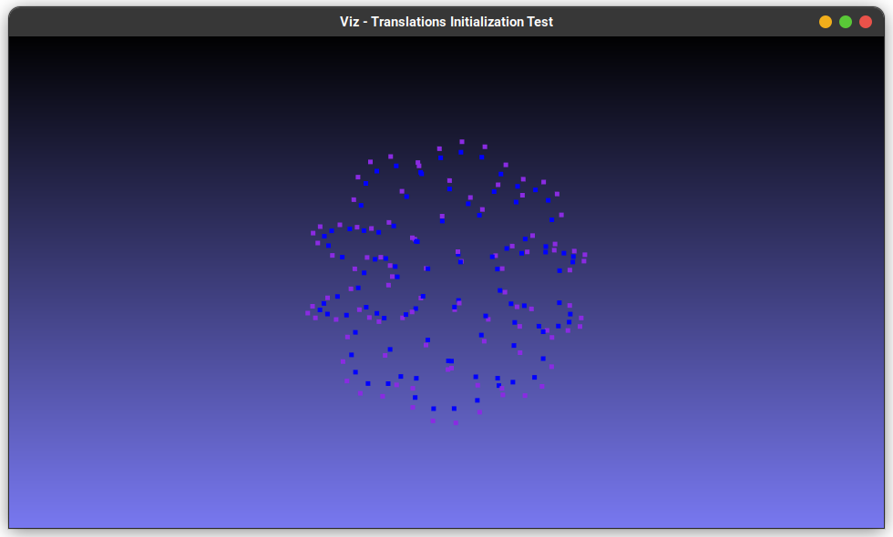

# **Structure from Motion** (1b) - Probabilistic Robotics Project

## Step 0 - Translations initialization
Least Squares to estimate the *position of each camera* (MultiPoseRegistration-like) using the *epipolar constraint as error function* and the estimated global camera orientations from project 1a.<br/>

The initialized translations are extracted from the null space of the H matrix of the LS problem selecting one of the rightmost columns of the V matrix of its SVD decomposition.These rightmost column in fact form a basis of the H matrix null space. [see **src/init_translation.\***] <br/>

The relative position between each pair of cameras is required for epipolar constraint evaluation. It is estimated through the following procedure [see **src/relative_position_calculator.\***]:
1) *8-point-algorithm* to estimate the *essential matrix* using corresponding direction vectors of the two cameras
2) Relative *position extraction* from the essential matrix. It is selected among the possible solutions tanking the one with the highest number of points in front of the camera. This has been done triangulating the two corresponding direction vectors for each landmark and then projecting it along the z-axis of each camera. 


## Step 1 - Landmarks Triangulation
To get the 3D *position of each landmark* using *direction vectors* to calculate line intersection points [see the [reference](https://silo.tips/download/least-squares-intersection-of-lines) (Section 3) and **src/triangulation.\***]. <br/>

Each position is calculated solving a LS problem using all the direction vectors corresponding to the same landmark coming from all the available cameras.

## Step 2 - Bundle Adjustment
Final refinement of camera poses and landmarks position formulated as a LS problem [see **src/bundle_adjustment.\***] trying to minimize the **Pose-Landmark error** (difference between measured and predicted direction vectors).

## Step 3 - Landmarks Registration
Estimation of the Sim(3) tranformation between estimated and reference landmark positions [see the [reference](https://gitlab.com/grisetti/probabilistic_robotics_2022_23/-/blob/main/slides/probabilistic_robotics_23b_registration_on_a_manifold.pdf) and **src/icp_3d.\***]

<!-- **NOTE_1**: This transformation for the moment has been used only in the landmark evaluation step. -->

## Step 4 - Evaluation methods
Camera positions, camera orientations and landmark positions are evaluated independently comparing them with the Ground Truth values through the following procedures [see **src/evaluation.\***]:

### Camera positions:
For each camera pair:
1) Compute the norm of the estimated relative position of camera j with respect to camera i
2) Compute the norm of the reference relative position of camera j with respect to camera i
3) Compute the ratio between these two values

The value of this ration should be the same for all the pose pairs.

### Camera orientations:
For each camera pair:
1) Compute the delta rotation between the two estimated orientations
2) Compute the delta rotation between the two reference orientations
3) Compare the two delta rotations: *trace(eye(3) - R_delta^T * R_delta_gt)*

### Landmark positions:
1) Transform each GT landmark position using the Sim(3) transformation estimated in Step 3
2) Compute the Root Mean Squared Error between estimated and transformed GT landmark positions


## Step 5 - Visualization
<div align="center">  </div>
At the end a window like that in the above image should appear, showing:

- Estimated camera positions in blue
- Estimated landmark positions in red
- GT camera positions in violet
- GT landmark positions in green

<br/> 

# **Hot to Run**
**Compiler:** GCC 11.3.0
```bash
 ./build/executables/sfm <Dataset path> <GT_Landmarks path> <Output directory>  <BundleAdjustment rounds> <SICP rounds>
```

## **Final outputs**
In the *out* directory it's possible to find the output produced by the following command:
```bash
 ./build/executables/sfm dataset_and_info/dataset.txt dataset_and_info/GT_landmarks.txt out/ 5 200
```

- (**cameras.txt**) Global position and orientation of each camera 
- (**landmarks.txt**) Global position of each landmark 
- (**camera_position_errors.txt**) Camera positions error values 
- (**camera_rotation_errors.txt**) Camera rotations error values 
- (**landmarks_error.txt**) Landmarks RMSE with the used Sim(3) 
- (**terminal.txt**) Output printed on the terminal

# Tests
- [X] sicp_3d (```build/executables/test_sicp_3d```)
  - [X] v2RPY
  - [X] Sim3
    - [X] * operator
    - [X] boxplus
<div align="center">  </div>
  
- [X] triangulation (```build/executables/test_triangulation```) --> **ok BUT not robust to outliers**
<div align="center">  </div>
<div align="center">  </div>

- [X] calculate_relative_position (```build/executables/test_relative_pos <Dataset Path> <GT Landmarks Path>```) (works using OpenCV)
  - [ ] eight_point_algorithm (custom implementation not working)
  - [ ] extract_t (custom implementation not working)

- [X] init_translations (```build/executables/test_init_t <Dataset Path> <GT Landmarks Path>```)
<div align="center">  </div>

- [X] bundle_adjustment (```build/executables/test_BA <Input BA Path> <GT Landmarks Path>```)

- [X] data_loading